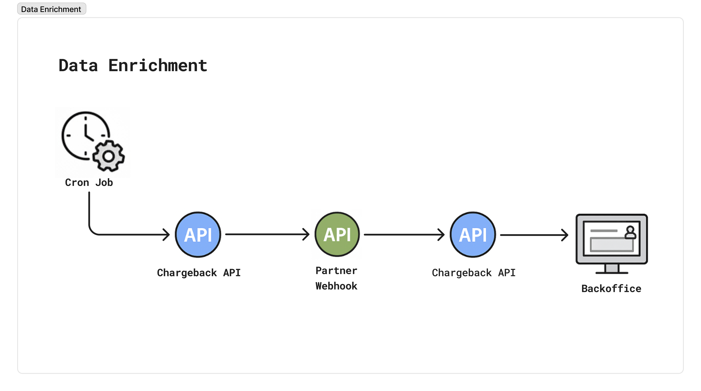

# Merchant & Partner Enrichment



## We will send you a webhook notification (HTTP POST) in the following format:

```jsonc
{
	"event": "merchant",
	"payload": {
		"contractDisputeId": "d492bhhnshts7160i570",
		"acquirerMerchantIdentifier": "004000000396144"
	}
}
```

### Webhook Payload Fields

| Field | Type | Required | Description |
|-------|------|----------|-------------|
| `event` | string | Yes | Event type identifier. Always "merchant" for merchant enrichment requests |
| `payload` | object | Yes | Container for the merchant identification data |
| `payload.contractDisputeId` | string | Yes | Tupi's internal unique identifier for the dispute contract |
| `payload.acquirerMerchantIdentifier` | string | Yes | Acquirer's unique identifier for the merchant |

## You must then send us an HTTP POST request to the callback URL provided during setup (contact us if you're unsure which endpoint to use).

```jsonc
{
    "type": "merchant",
    "data": {
        "merchant": {
            "taxId": "11222333000123",
            "legalName": "ACME INC",
            "dbaName": "ACME Rocketz",
            "acquirerMerchantIdentifier": "002000200362510",
            "economicActivityCode": "20.92-4",
            "address": {
                "country": "BR",
                "postalCode": "12929662",
                "street": "Fourth Street",
                "number": "622",
                "complement": "Building A",
                "neighborhood": "Downtown",
                "state": "SP",
                "city": "Sample City"
            },
            "contact": {
                "name": "John Doe",
                "email": "contact@example.com",
                "phone": "5511955226677"
            }
        },
        "partner": {
            "taxId": "22333666000155",
            "legalName": "PARTNER EXAMPLE",
            "dbaName": "PARTNER EXAMPLE",
            "partnerAcquirerIdentifier": "002005500362123",
            "address": {
                "country": "BR",
                "postalCode": "12929662",
                "street": "Fourth Street",
                "number": "622",
                "complement": "Building A",
                "neighborhood": "Downtown",
                "state": "SP",
                "city": "Sample City"
            },
            "contact": {
                "name": "John Doe",
                "email": "contact@example.com",
                "phone": "5511955226677"
            }
        }
    }
}
```

### Callback Request Fields

| Field | Type | Required | Description |
|-------|------|----------|-------------|
| `type` | string | Yes | Request type identifier. Always "merchant" for merchant data |
| `data` | object | Yes | Container for merchant and partner data |
| `data.merchant` | object | Yes | Merchant information object |
| `data.partner` | object | No | Partner information object (optional) |

### Merchant Object Fields

| Field | Type | Required | Description |
|-------|------|----------|-------------|
| `taxId` | string | Yes | Merchant's tax identification number (CNPJ in Brazil) |
| `legalName` | string | Yes | Official legal name of the merchant |
| `dbaName` | string | Yes | "Doing Business As" name (trade name) |
| `acquirerMerchantIdentifier` | string | Yes | Acquirer's unique identifier for the merchant |
| `economicActivityCode` | string | No | Economic activity classification code |
| `address` | object | No | Merchant's address information |
| `contact` | object | Yes | Merchant's contact information |

### Partner Object Fields

| Field | Type | Required | Description |
|-------|------|----------|-------------|
| `taxId` | string | Yes | Partner's tax identification number (CNPJ in Brazil) |
| `legalName` | string | Yes | Official legal name of the partner |
| `dbaName` | string | Yes | "Doing Business As" name (trade name) |
| `partnerAcquirerIdentifier` | string | Yes | Acquirer's unique identifier for the partner |
| `address` | object | No | Partner's address information |
| `contact` | object | Yes | Partner's contact information |

### Address Object Fields

| Field | Type | Required | Description |
|-------|------|----------|-------------|
| `country` | string | Yes | Two-letter country code (ISO 3166-1 alpha-2) |
| `postalCode` | string | Yes | Postal/ZIP code |
| `street` | string | Yes | Street name |
| `number` | string | Yes | Street number |
| `complement` | string | No | Additional address information (building, apartment, etc.) |
| `neighborhood` | string | Yes | Neighborhood or district name |
| `state` | string | Yes | State or province code |
| `city` | string | Yes | City name |

### Contact Object Fields

| Field | Type | Required | Description |
|-------|------|----------|-------------|
| `name` | string | Yes | Contact person's full name |
| `email` | string | Yes | Contact email address |
| `phone` | string | Yes | Contact phone number with country code |