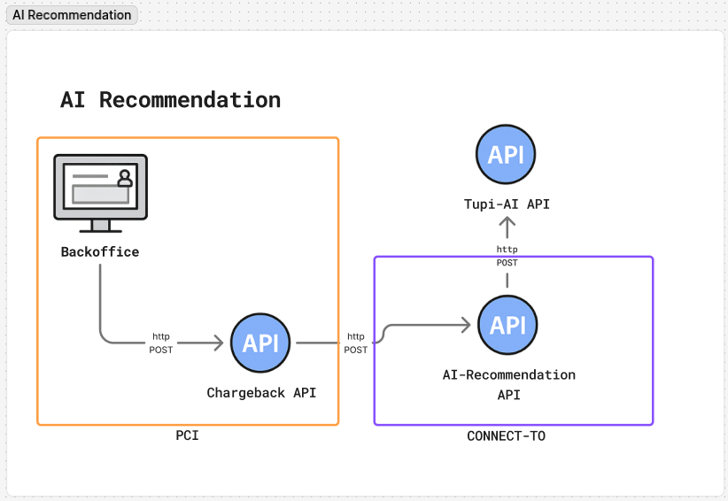

# API Data – Agent AI – Chargeback

## Agent by OpenAI



Input

```json
{
  "language": "en",
  "card_brand": "Visa",
  "reason_code": "13.1 - Merchandise/Services Not Received",
  "transaction": {
    "amount": 29999,
    "date": "2025-01-15T14:30:00Z",
    "merchant_id": "MERCH-12345"
  },
  "chargeback": {
    "amount": 29999,
    "received_date": "2025-02-20T09:15:00Z"
  },
  "dispute_details": {
    "cardholder_claim": "Customer claims package was never delivered despite tracking showing delivery confirmation",
    "merchant_response": "Merchant refutes claim"
  },
  "documents_available": ["Documents URLs"]
}
```

| **Field**                           | **Type**           | **Description**                                                      | **Example**                                        |
| ----------------------------------- | ------------------ | -------------------------------------------------------------------- | -------------------------------------------------- |
| `language`                          | String (ISO 639-1) | Language code used for texts                                         | `"en"`                                             |
| `card_brand`                        | String             | Card network/brand involved in the transaction                       | `"Visa"`                                           |
| `reason_code`                       | String             | Chargeback reason code and description according to the card network | `"13.1 - Merchandise/Services Not Received"`       |
| `transaction`                       | Object             | Original transaction details                                         | *See subfields below*                              |
| `transaction.amount`                | Decimal            | Transaction amount in the smallest currency unit                     | `29999` (=$299.99)                                 |
| `transaction.date`                  | String (ISO 8601)  | Original transaction date and time (UTC)                             | `"2025-01-15T14:30:00Z"`                           |
| `transaction.merchant_id`           | String             | Unique merchant identifier                                           | `"MERCH-12345"`                                    |
| `chargeback`                        | Object             | Specific dispute details                                             | *See subfields below*                              |
| `chargeback.amount`                 | Decimal            | Chargeback amount                                                    | `29999`                                            |
| `chargeback.received_date`          | String (ISO 8601)  | Date and time the chargeback was received (UTC)                      | `"2025-02-20T09:15:00Z"`                           |
| `dispute_details`                   | Object             | Additional dispute information                                       | *See subfields below*                              |
| `dispute_details.cardholder_claim`  | String             | Description of the claim made by the cardholder                      | `"Customer claims package was never delivered..."` |
| `dispute_details.merchant_response` | String             | Description of the response made by the merchant                     | `"Merchant refutes claim"`                         |
| `documents_available`               | String             | Document URLs                                                        | *File attached*                                    |
