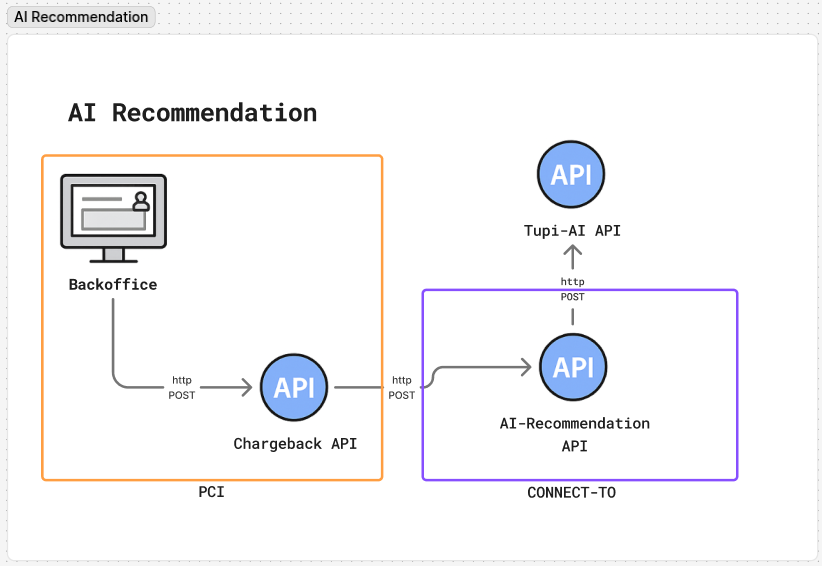

# Dados da API – IA Agente – Chargeback

## Privacidade de Dados e Compliance

Nenhum número de cartão (PAN), CVV ou outro dado de autenticação do cartão é enviado ao motor de recomendação por IA — apenas a bandeira do cartão (`card_brand`) e dados agregados/mascarados da transação (valores, datas e identificadores internos) são utilizados. Campos de texto livre (`cardholder_claim`, `merchant_response`) podem conter dados pessoais fornecidos pelas partes da disputa e são processados exclusivamente para fins de recomendação de chargeback e análise de evidências. Arquivos de evidência são processados apenas para OCR e classificação de documento; nenhum dado de autenticação do portador do cartão (dados da tarja, PIN, CVV) é extraído ou armazenado. Esse processamento é realizado em conformidade com a LGPD (Lei 13.709/2018), o GDPR e os princípios de minimização de dados e limitação de escopo do PCI-DSS.

## Motor de Recomendação por IA



Entrada

```jsonc
{
  "organization_id": "org_12133232",
  "contract_dispute_id": "cd_1234567890",
  "cycle_id": "cy_1223232",
  "language": "pt-BR",
  "reason_code": "13.1 - Merchandise/Services Not Received",
  "card_brand": "visa", // enum: visa | master | elo | amex
  "transaction": {
    "authorized_at": "2025-01-15T14:30:00Z",
    "merchant_id": "MERCH-12345",
    "currency": "BRL",
    "amount": 29999
  },
  "chargeback": {
    "received_at": "2025-02-20T09:15:00Z",
    "cycle_type": null,
    "amount": 29999
  },
  "details": {
    "cardholder_claim": "Cliente alega que o pacote nunca foi entregue, apesar do rastreamento mostrar confirmação de entrega",
    "merchant_response": "Comerciante refuta a alegação"
  }
}
```

### Campos da Requisição de Recomendação

| **Campo**                  | **Tipo**            | **Obrigatório** | **Descrição**                                                          | **Exemplo**                                       |
| --------------------------- | -------------------- | ----------------- | -------------------------------------------------------------------------- | ---------------------------------------------------- |
| `organization_id`           | String                | Sim                | Identificador interno da organização na Tupi                               | `"org_12133232"`                                      |
| `contract_dispute_id`       | String                | Sim                | Identificador interno único do contrato de disputa na Tupi                 | `"cd_1234567890"`                                     |
| `cycle_id`                  | String                | Sim                | Identificador interno do ciclo de disputa na Tupi                          | `"cy_1223232"`                                        |
| `language`                  | String (ISO 639-1)   | Sim                | Código do idioma usado para textos                                         | `"pt-BR"`                                             |
| `reason_code`                | String                | Sim                | Código de motivo e descrição do chargeback conforme a rede                | `"13.1 - Merchandise/Services Not Received"`          |
| `card_brand`                 | String (enum)         | Sim                | Rede/bandeira do cartão envolvida na transação. Valores: `visa`, `master`, `elo`, `amex` | `"visa"`                          |
| `transaction`                | Object                 | Não                | Detalhes da transação original                                              | *Veja subcampos abaixo*                               |
| `transaction.authorized_at`  | String (RFC 3339)     | Não                | Data e hora de autorização da transação original (UTC)                     | `"2025-01-15T14:30:00Z"`                              |
| `transaction.merchant_id`    | String                 | Não                | Identificador único do comerciante                                          | `"MERCH-12345"`                                       |
| `transaction.currency`       | String                 | Não                | Código da moeda da transação                                                | `"BRL"`                                               |
| `transaction.amount`         | Decimal                | Sim                | Valor da transação na menor unidade monetária                              | `29999` (=R$299,99)                                   |
| `chargeback`                  | Object                 | Sim                | Detalhes específicos da disputa                                             | *Veja subcampos abaixo*                               |
| `chargeback.received_at`      | String (RFC 3339)      | Sim                | Data e hora em que o chargeback foi recebido (UTC)                         | `"2025-02-20T09:15:00Z"`                              |
| `chargeback.cycle_type`       | String                  | Não                | Tipo do ciclo de disputa, quando aplicável                                  | `null`                                                |
| `chargeback.amount`           | Decimal                 | Sim                | Valor do chargeback na menor unidade monetária                             | `29999`                                               |
| `details`                      | Object                  | Não                | Informações adicionais da disputa                                           | *Veja subcampos abaixo*                               |
| `details.cardholder_claim`     | String                  | Não                | Descrição da alegação feita pelo portador do cartão                        | `"Cliente alega que o pacote nunca foi entregue..."`  |
| `details.merchant_response`    | String                  | Não                | Descrição da resposta fornecida pelo comerciante                           | `"Comerciante refuta a alegação"`                     |

## Envio de Evidências

Arquivos de evidência (ex.: comprovante de entrega, notas fiscais, registros de comunicação) são enviados em uma requisição separada, no formato `multipart/form-data`, vinculados à mesma disputa por meio dos identificadores abaixo. Cada arquivo é processado individualmente para OCR e classificação de documento, e o resultado é associado à disputa.

### Campos da Requisição de Envio de Evidência

| **Campo**             | **Tipo**  | **Obrigatório** | **Descrição**                                                     | **Exemplo**           |
| ----------------------- | --------- | ----------------- | ----------------------------------------------------------------------- | ------------------------ |
| `file`                   | Binário   | Sim                | Conteúdo do arquivo de evidência                                       | *arquivo binário*         |
| `organization_id`        | String    | Sim                | Identificador interno da organização na Tupi                            | `"org_12133232"`          |
| `contract_dispute_id`    | String    | Sim                | Identificador interno único do contrato de disputa na Tupi              | `"cd_1234567890"`         |
| `cycle_id`               | String    | Sim                | Identificador interno do ciclo de disputa na Tupi                       | `"cy_1223232"`            |
| `step_id`                | String    | Sim                | Identificador da etapa da disputa à qual a evidência pertence           | `"step_123456"`           |
| `step_type`              | String    | Sim                | Tipo da etapa da disputa                                                | `"chargeback"`            |
| `reason_code`             | String    | Não                | Código de motivo do chargeback, quando aplicável                       | `"10.1"`                  |
| `filename`                | String    | Sim                | Nome original do arquivo                                                | `"evidence.pdf"`          |
