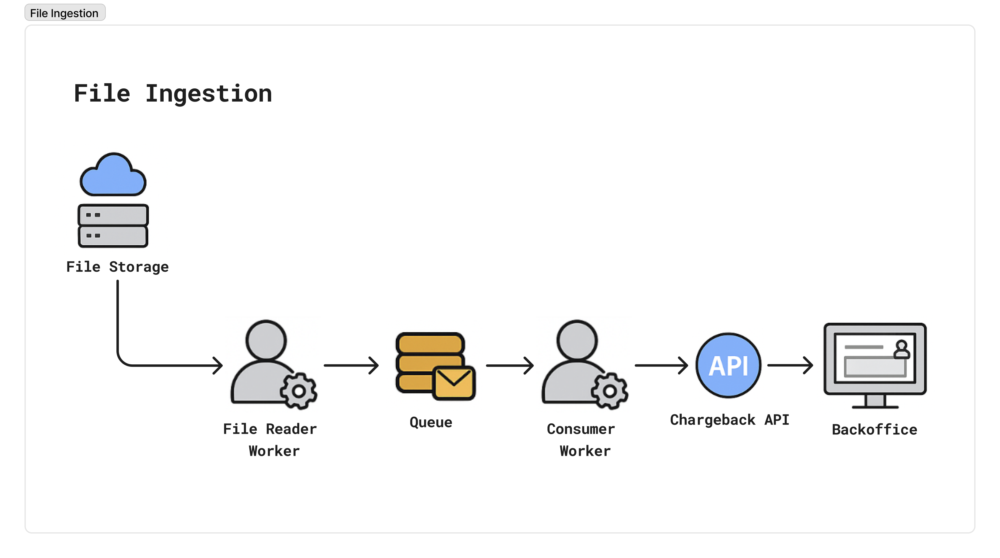
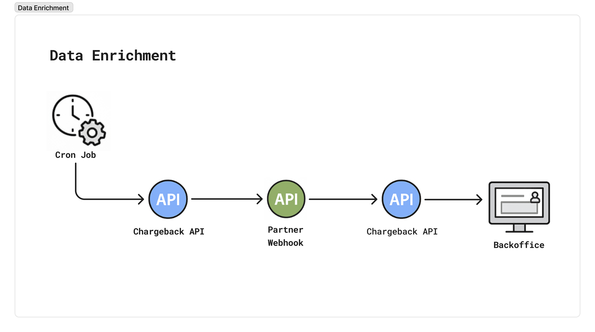
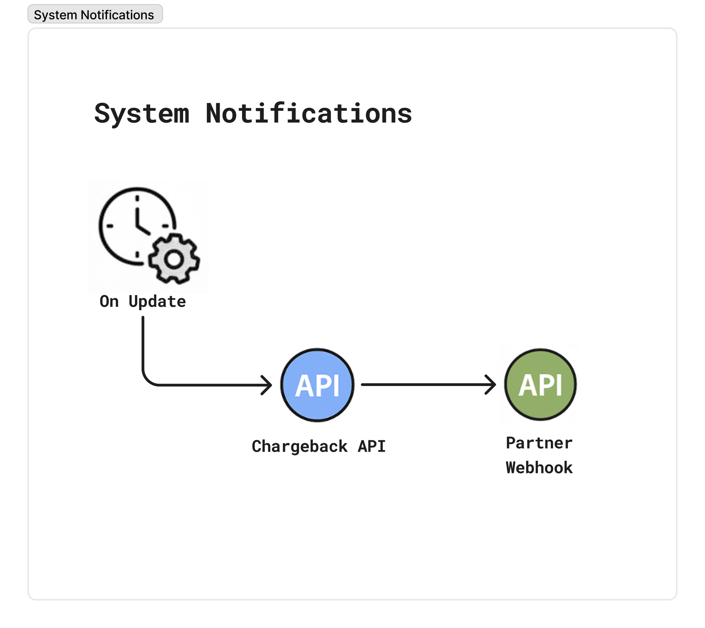
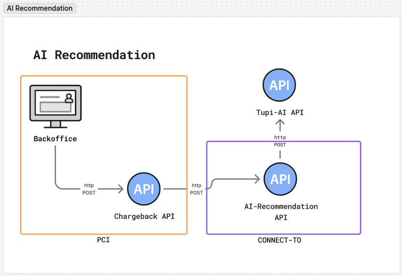

# 📋 Documentación del Sistema de Contracargo

[]()
[]()
[]()

> 📚 Documentación completa de las APIs y notificaciones del sistema de gestión de contracargos

## 🌐 Versiones de Idioma

- 🇺🇸 [English](./README.md)
- 🇪🇸 **Español** (actual)
- 🇧🇷 [Português](./README.pt-br.md)

## 🎯 Descripción General

Este repositorio contiene la documentación técnica completa del sistema de contracargo, incluyendo especificaciones de APIs, formatos de notificaciones y flujos de datos para integración con sistemas externos.



## 📁 Estructura de la Documentación

### 🔄 1. Enrichment (Enriquecimiento de Datos)



> **Nota:** El área destacada representa componentes que deben ser desarrollados por el cliente. Esto incluye implementar la lógica para obtener los datos internos y enviar las respuestas a nuestro sistema durante el flujo de enriquecimiento.

Documentación del flujo de enriquecimiento de datos entre sistema y cliente:

| Archivo | Descripción | Flujo de Datos |
|---------|-------------|----------------|
| [`1.TRANSACTION.md`](./1.Enrichment/1.TRANSACTION.es.md) | 💳 **Datos de Transacción**<br/>📤 `TransactionEvent`: Enviado al cliente<br/>📥 `TransactionResponse`: Recibido vía API | **Event** → Cliente<br/>**Response** ← Cliente |
| [`2.MERCHANT.md`](./1.Enrichment/2.MERCHANT.es.md) | 🏪 **Datos del Comercio**<br/>📤 `MerchantEvent`: Enviado al cliente<br/>📥 `MerchantResponse`: Recibido vía API | **Event** → Cliente<br/>**Response** ← Cliente |

### 📢 2. Notifications (Notificaciones del Sistema)



Documentación de las notificaciones de estado y ciclo de vida de los contracargos:

| Archivo | Descripción | Tipo de Evento |
|---------|-------------|----------------|
| [`3.STATUS.md`](./2.Notifications/3.STATUS.es.md) | 📊 **Notificaciones de Estado** - Actualizaciones de estado del proceso de contracargo | `status` |
| [`4.CYCLE.md`](./2.Notifications/4.CYCLE.es.md) | 🔄 **Notificaciones de Ciclo** - Cambios de ciclo (contracargo, pre-arbitraje, arbitraje) | `cycle` |

### 🤖 3. AI (Inteligencia Artificial)



Documentación de la integración con agente de IA para recomendaciones de contracargo:

| Archivo | Descripción | Tipo de Datos |
|---------|-------------|---------------|
| [`5.AI.md`](./3.AI/5.AI.md) | 🧠 **Datos del Agente de IA** - Datos de entrada enviados al agente de IA de recomendación de contracargo | API de Entrada |

## 📋 Tipos de Comunicación Disponibles

### 🔄 Enriquecimiento de Datos (Events ↔ Responses)

| Tipo | Enviamos (Event) | Recibimos (Response) | Documentación |
|------|------------------|---------------------|---------------|
| `transaction` | Solicita datos de transacción | Datos completos de transacción | [TRANSACTION.md](./1.Enrichment/1.TRANSACTION.es.md) |
| `merchant` | Solicita datos del comercio | Datos completos del comercio | [MERCHANT.md](./1.Enrichment/2.MERCHANT.es.md) |

### 📢 Notificaciones Unidireccionales (Events)

| Tipo | Enviamos (Event) | Propósito | Documentación |
|------|------------------|-----------|---------------|
| `status` | Actualización de estado | Informar cambios de estado | [STATUS.md](./2.Notifications/3.STATUS.es.md) |
| `cycle` | Cambio de ciclo | Informar alteraciones de ciclo | [CYCLE.md](./2.Notifications/4.CYCLE.es.md) |

## 🔧 Integración

### 📤📥 Flujo de Comunicación

El sistema utiliza dos tipos de comunicación:

#### 📤 **Events (Eventos)** - Enviados por el Sistema
Notificaciones que **enviamos al cliente** cuando necesitamos datos adicionales:
- Contienen identificadores mínimos necesarios
- Solicitan enriquecimiento de datos específicos
- Se envían vía webhook/notificación

#### 📥 **Responses (Respuestas)** - Recibidas vía API  
Datos completos que **recibimos del cliente** vía API para actualizar nuestro sistema:
- Contienen todos los datos detallados solicitados
- Son enviados por el cliente a través de llamadas API
- Actualizan la información en nuestro sistema

### Estructura Base de los Eventos

Todos los eventos enviados siguen una estructura base común:

```typescript
type BaseEvent = {
    event: string;
    payload: {
        contractDisputeId: string;
        // ... identificadores específicos por tipo de evento
    };
}
```

### Estructura Base de las Respuestas

Las respuestas recibidas vía API contienen datos completos:

```typescript
type BaseResponse = {
    // Datos completos y detallados del objeto solicitado
    // La estructura varía según el tipo de datos
}
```

### Identificadores Principales

- **`contractDisputeId`**: Identificador único del contrato de disputa
- **`transactionIdentifier`**: Identificador de transacción
- **`acquirerReferenceNumber`**: Número de referencia del adquirente
- **`helpdeskCaseIdentifier`**: Identificador del caso de helpdesk

## ⚙️ Requisitos Mínimos

Para ejecutar el sistema de contracargo, asegúrese de que su ambiente cumpla con los siguientes requisitos mínimos:

### 🖥️ Requisitos de Hardware
- **CPU**: 1 vCPU mínimo
- **RAM**: 512MB mínimo
- **Almacenamiento**: Almacenamiento de objetos compatible con S3 (tamaño depende del volumen del cliente)

### 🗄️ Requisitos de Base de Datos
- **PostgreSQL**: Base de datos PostgreSQL compatible (versión 17+ recomendada)

### ☸️ Requisitos de Kubernetes
- **Pods**: 2 pods mínimo para alta disponibilidad
- **Versión de Kubernetes**: 1.20+ recomendado
- **Red**: Controlador de ingress configurado para acceso externo

### 📊 Requisitos de Reportes e BI
- **Metabase**: Plataforma de Business Intelligence para crear gráficos y dashboards
  - Requerido para visualización de datos y reportes
  - Consulte los [requisitos de Metabase](https://www.metabase.com/docs/latest/installation-and-operation/installing-metabase)

### 🔒 Requisitos de Seguridad
- **TLS**: Certificados SSL/TLS para endpoints HTTPS
- **Autenticación**: Keycloak como solución de gestión de identidad y acceso
  - Consulte los [requisitos de Keycloak](https://www.keycloak.org/high-availability/concepts-memory-and-cpu-sizing)

## 📞 Soporte

Para preguntas o sugerencias sobre esta documentación, contacte al equipo de desarrollo.

---

<div align="center">

**📄 Documentación mantenida por el equipo Tupi Fintech**

*Última actualización: Abril 2026*

</div>
