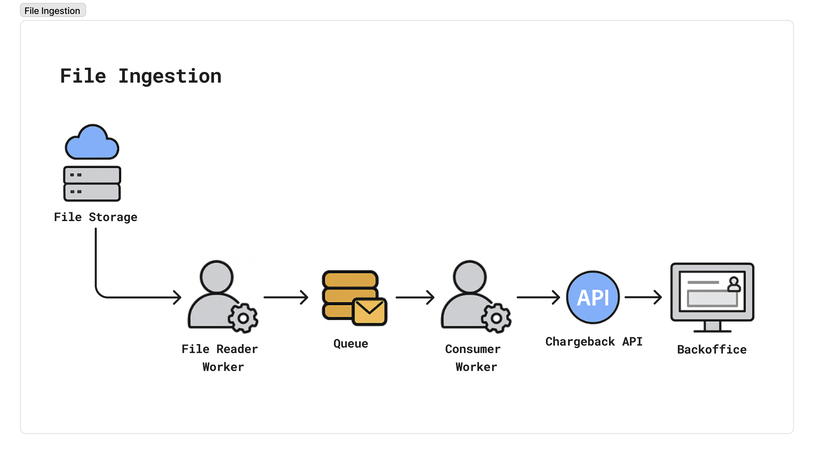
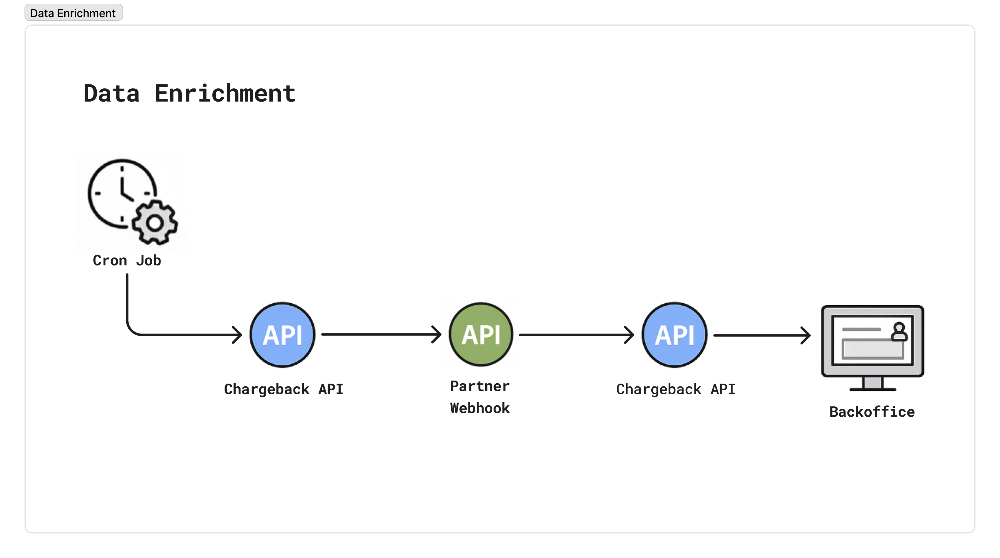

# 📋 Chargeback System Documentation

[]()
[]()
[]()

> 📚 Complete documentation for APIs and notifications of the chargeback management system

## 🌐 Language Versions

- 🇺🇸 **English** (current)
- 🇪🇸 [Español](./README.es.md)
- 🇧🇷 [Português](./README.pt-br.md)

## 🎯 Overview

This repository contains the complete technical documentation of the chargeback system, including API specifications, notification formats, and data flows for integration with external systems.



## 📁 Documentation Structure

### 🔄 1. Enrichment (Data Enrichment)



Documentation of data enrichment flow between system and client:

| File | Description | Data Flow |
|------|-------------|-----------|
| [`1.TRANSACTION.md`](./1.Enrichment/1.TRANSACTION.md) | 💳 **Transaction Data**<br/>📤 `TransactionEvent`: Sent to client<br/>📥 `TransactionResponse`: Received via API | **Event** → Client<br/>**Response** ← Client |
| [`2.MERCHANT.md`](./1.Enrichment/2.MERCHANT.md) | 🏪 **Merchant Data**<br/>📤 `MerchantEvent`: Sent to client<br/>📥 `MerchantResponse`: Received via API | **Event** → Client<br/>**Response** ← Client |

### 📢 2. Notifications (System Notifications)


Documentation of status and lifecycle notifications for chargebacks:

| File | Description | Event Type |
|------|-------------|------------|
| [`3.STATUS.md`](./2.Notifications/3.STATUS.md) | 📊 **Status Notifications** - Chargeback process status updates | `status` |
| [`4.CYCLE.md`](./2.Notifications/4.CYCLE.md) | 🔄 **Cycle Notifications** - Cycle changes (chargeback, pre-arbitration, arbitration) | `cycle` |

## 🚀 How to Use This Documentation

1. **For Developers**: 
   - Consult **Events** files to implement notification reception
   - Consult **Responses** files to implement data return APIs
   - Use specified formats to ensure correct integration

2. **For Analysts**: 
   - Use documentation to understand bidirectional data flows
   - Understand when the system requests data (Events) vs when it receives data (Responses)

3. **For Support**: 
   - Use as reference for integration troubleshooting
   - Identify if issues are in Event sending or Response receiving

## 📋 Available Communication Types

### 🔄 Data Enrichment (Events ↔ Responses)

| Type | We Send (Event) | We Receive (Response) | Documentation |
|------|-----------------|----------------------|---------------|
| `transaction` | Request transaction data | Complete transaction data | [TRANSACTION.md](./1.Enrichment/1.TRANSACTION.md) |
| `merchant` | Request merchant data | Complete merchant data | [MERCHANT.md](./1.Enrichment/2.MERCHANT.md) |

### 📢 Unidirectional Notifications (Events)

| Type | We Send (Event) | Purpose | Documentation |
|------|-----------------|---------|---------------|
| `status` | Status update | Inform status changes | [STATUS.md](./2.Notifications/3.STATUS.md) |
| `cycle` | Cycle change | Inform cycle alterations | [CYCLE.md](./2.Notifications/4.CYCLE.md) |

## 🔧 Integration

### 📤📥 Communication Flow

The system uses two types of communication:

#### 📤 **Events** - Sent by System
Notifications that **we send to the client** when we need additional data:
- Contain minimal necessary identifiers
- Request specific data enrichment
- Are sent via webhook/notification

#### 📥 **Responses** - Received via API  
Complete data that **we receive from the client** via API to update our system:
- Contain all detailed requested data
- Are sent by the client through API calls
- Update information in our system

### Base Event Structure

All sent events follow a common base structure:

```typescript
type BaseEvent = {
    event: string;
    payload: {
        contractDisputeId: string;
        // ... specific identifiers per event type
    };
}
```

### Base Response Structure

Responses received via API contain complete data:

```typescript
type BaseResponse = {
    // Complete and detailed data of the requested object
    // Structure varies according to data type
}
```

### Main Identifiers

- **`contractDisputeId`**: Unique identifier of the dispute contract
- **`transactionIdentifier`**: Transaction identifier
- **`acquirerReferenceNumber`**: Acquirer reference number
- **`helpdeskCaseIdentifier`**: Helpdesk case identifier

## ⚙️ Minimum Requirements

To run the chargeback system, ensure your environment meets the following minimum requirements:

### 🖥️ Hardware Requirements
- **CPU**: 1 vCPU minimum
- **RAM**: 512MB minimum
- **Storage**: S3-compatible object storage (size depends on client volume)

### 🗄️ Database Requirements
- **PostgreSQL**: Compatible PostgreSQL database (version 12+ recommended)

### ☸️ Kubernetes Requirements
- **Pods**: 2 pods minimum for high availability
- **Kubernetes Version**: 1.20+ recommended
- **Network**: Ingress controller configured for external access

### 🔒 Security Requirements
- **TLS**: SSL/TLS certificates for HTTPS endpoints
- **Authentication**: Keycloak as identity and access management solution
  - See [Keycloak requirements](https://www.keycloak.org/high-availability/concepts-memory-and-cpu-sizing)

## 📞 Support

For questions or suggestions about this documentation, contact the development team.

---

<div align="center">

**📄 Documentation maintained by Tupi Fintech team**

*Last update: September 2025*

</div>